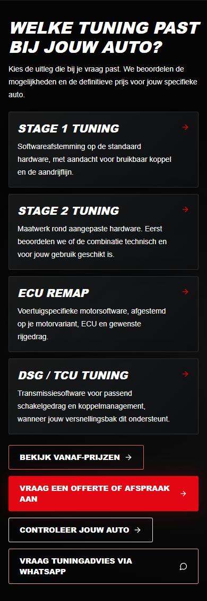
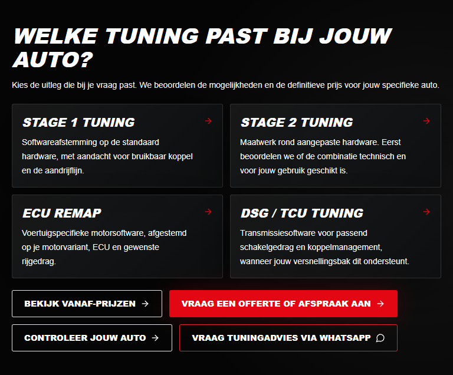
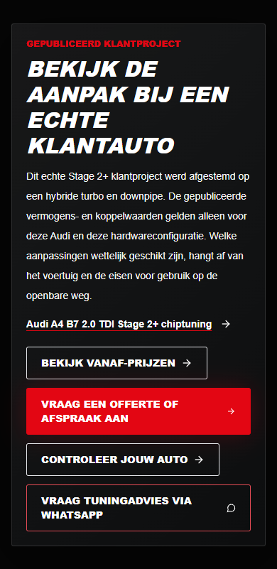
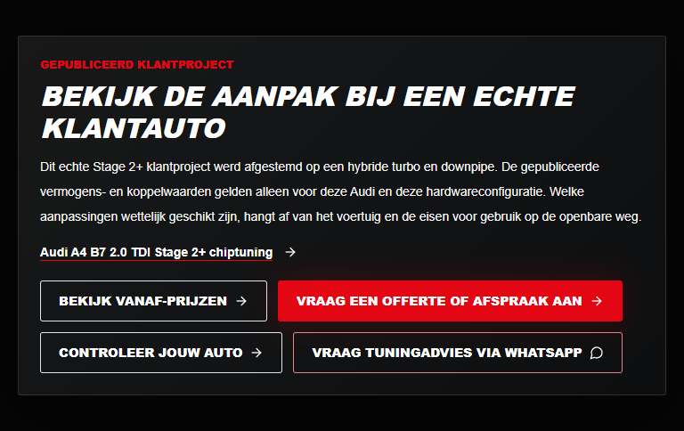
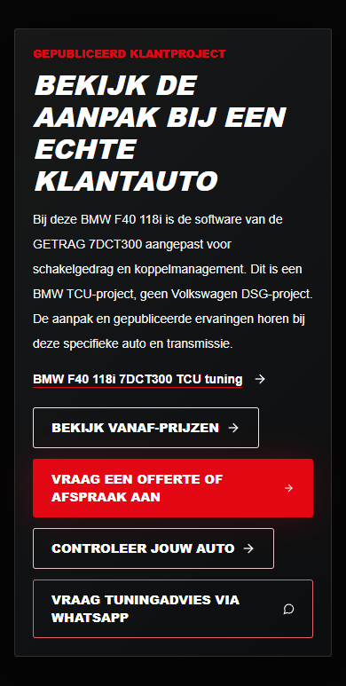
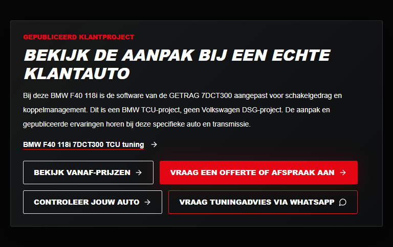

# Chiptuning service growth — review report

Date: 2026-10-07. Branch: `feature/chiptuning-service-growth-2026-10`.
Base: synchronized `origin/main` at `909ac28d1f9aeb72b42ed5be348a8c5666bb1ace`.
Development and a PR Preview were explicitly authorized; production release was not.

## Customer journey

Before: the Dutch chiptuning page explained tuning and linked recent projects and brands, but lacked a direct service chooser. The Dutch DSG/TCU card led to `/nl/diensten`, including a self-link there. Stage 2 and DSG/TCU explanations did not link their matching published customer projects.

After: one compact section directly below the Dutch chiptuning hero explains four service choices. Each leads to an existing page. The Stage 2 and DSG/TCU pages each contain a concise, relevant project link and access to existing pricing, appointment enquiry, catalog and WhatsApp options. Existing brand and recent-project sections remain intact.

### Exact destinations

| Entry point | Destination |
| --- | --- |
| Chiptuning chooser: Stage 1 | `/nl/stage-1-tuning` |
| Chiptuning chooser: Stage 2 | `/nl/stage-2-tuning` |
| Chiptuning chooser: ECU remap | `/nl/ecu-remap` |
| Chiptuning chooser and Dutch DSG/TCU card | `/nl/dsg-tcu-tuning` |
| Starting prices in all three new sections | `/nl/prijzen` |
| Quotation/appointment in all three new sections | `/nl/afspraak`, from `pathFor("nl", "appointment")` |
| Stage 2 customer evidence | `/nl/resultaten/audi-a4-b7-20-tdi-stage-2-plus` |
| TCU customer evidence | `/nl/resultaten/bmw-f40-118i-7dct300-tcu-tuning` |
| Power Catalog in all three new sections | `https://power.noordtune.nl/` |
| WhatsApp in all three new sections | `https://wa.me/31685759600` |

EN/PL service cards retain their configured `/en/services` and `/pl/uslugi` destinations. No translated dedicated service URLs were invented. The new chooser and proof sections appear only on the intended Dutch pages.

## Customer evidence

Both links resolve approved, published/indexable records using `customerResultFromRoute`, and derive destinations with `customerResultPath`.

- Audi A4 B7 2.0 TDI: the existing Stage 2+ project used a hybrid turbo and downpipe. The new text states that published output applies only to this vehicle/configuration and that legal suitability depends on the vehicle and public-road requirements. No numerical performance promise was added.
- BMW F40 118i: the published GETRAG 7DCT300 TCU project supports a transmission-calibration link. It is explicitly identified as BMW TCU work, not a Volkswagen DSG project. No engine-context figures were turned into a TCU gain claim.

Customer-result facts, images, dates, claims and source data were not edited. Existing prices are accessed through the pricing page; no prices were changed.

## SEO and analytics safeguards

- Canonicals, hreflang, titles, existing URLs, root redirects and sitemap configuration are unchanged.
- No new landing pages, indexing configuration, forms, booking system or analytics provider.
- Existing `appointment_click`, `power_catalog_click` and `whatsapp_click` events use exactly `{locale: "nl", source: "site_cta"}`. Project links use `customer_result_click` with exactly `locale` and the published `slug`.
- The analytics helper, event allowlist, properties and providers are unchanged. Click interception verifies one event per new tracked action and no message/contact data in its properties.
- Browser interactions used synthetic data and intercepted external navigation/analytics; no WhatsApp message, email or production conversion event was sent by local QA.
- Power Catalog's application, data, routes, metadata and settings were not touched. All checked catalog links remain exactly `https://power.noordtune.nl/`.
- Dependencies and `pnpm-lock.yaml` are unchanged.

## Indexing context — historical, read-only

The preceding audit observed the following Search Console classifications in the main-site sitemap report updated October 4. These are historical report observations, not a new URL-inspection result for this feature branch:

| URL | October 4 observation |
| --- | --- |
| `/nl/stage-2-tuning` | Discovered, currently not indexed |
| `/nl/ecu-remap` | Discovered, currently not indexed |
| `/nl/dsg-tcu-tuning` | Crawled, currently not indexed |
| `/nl/chiptuning-drenthe` | Discovered, currently not indexed |
| `/nl/chiptuning-groningen` | Discovered, currently not indexed |

The audit separately found Google choosing `/` as the canonical for `/nl`. This PR changes neither signal nor redirect strategy. The live pages were accessible and permitted indexing; the cause of exclusions was not established. Weak internal discovery and limited case evidence are possible contributors, not proven causes. Historical impressions do not prove current indexing.

Follow-up: inspect the five URLs individually in Search Console, comparing last crawl, fetch/indexing permissions, declared/Google-selected canonicals and referring pages. Reassess after Google recrawls meaningful changes. No indexing requests or sitemap submissions were made. Internal linking does not guarantee indexing or ranking gains.

Owner-provided historical baseline for September 7–October 4: `/nl/chiptuning` had 12 clicks, 322 impressions, 3.7% CTR and average position 11.0. This report makes no traffic/revenue forecast.

## QA receipts

Local production build served at `http://127.0.0.1:3002`. Generic `pnpm content` and `pnpm test` do not exist; the actual existing scripts were used.

| Check | Result |
| --- | --- |
| `pnpm lint` | PASS |
| `pnpm typecheck` | PASS |
| `pnpm build` | PASS — 141 generated pages |
| `pnpm content:audit` | PASS |
| `pnpm test:seo` | PASS — 7 tests |
| `pnpm test:enquiry` | PASS — 11 tests |
| `pnpm test:analytics` | PASS — 6 tests |
| `pnpm test:brand` | PASS — 6 tests |
| `pnpm exec tsx scripts/test-service-journey-browser.ts` | PASS — six viewports; chooser navigation, published case links, target HTTP 200s, safe single events, pricing/appointment/catalog/WhatsApp paths, NL/EN/PL routes, JSON-LD parsing, self-canonicals, no overflow or console/runtime errors |
| `pnpm test:seo:browser` | PASS — 85 unique internal destinations; homepage counts, translated detail metadata and regression routes across four viewports |
| `pnpm test:enquiry:browser` | PASS — 40 cases; six localized forms, validation, message preview, encoded handoff, copy/fallback, social/contact links and iPad regression |
| `pnpm test:analytics:browser` | PASS — NL/EN/PL event payloads, single dispatch and failure-safe navigation |
| `pnpm test:brand:browser` | PASS — 14 routes across six viewports |
| Production/local HTTP comparison | PASS — identical titles/descriptions/robots/canonicals/hreflang and JSON-LD on 13 representative pages; identical sitemap; matching NL/EN/PL root-language redirects |

All browser base URL environment variables pointed to localhost. Journey viewports: 390×844, 430×932, 768×1024, 820×1180, 1180×820 and 1440×1000. Protected files were compared against `origin/main`; no SEO configuration, customer/brand data, dependency or catalog destination changes were found.

Initial focused-test harness failures were corrected: the SDK's undefined `options` field is omitted when comparing serialized events, and a network-idle wait held open by an existing lazy image was replaced by the page load event. Exact event count/payload, actual navigation, HTTP status and browser error assertions remain enabled. Screenshots were visually inspected.

Hosted Preview status is reported through the draft PR's Vercel check. These receipts describe local browser QA and must not be relabelled as a complete hosted Preview test run.

## Screenshots

Six selected captures are committed below. The test generates all six viewport sizes. Fixed header/floating controls are hidden only during section screenshots to prevent capture overlap; application styles are unchanged.

| Section | Mobile 390×844 | iPad 820×1180 |
| --- | --- | --- |
| Chooser |  |  |
| Stage 2 proof |  |  |
| TCU proof |  |  |

## Files changed

- `src/components/tuning-service-journey.tsx`: server-rendered Dutch chooser and focused proof; existing button/tracking components reused.
- `src/components/page-renderers.tsx`: one import and one Dutch-only chooser insertion after the page hero.
- `src/components/seo-landing-renderer.tsx`: one import and one proof insertion; returns no content for other landing pages.
- `src/components/cards.tsx`: accepts an explicit card destination while retaining localized page-key fallback.
- `src/content/copy.ts`: optional card href and corrected Dutch DSG destination only.
- `scripts/test-service-journey-browser.ts`: focused navigation, layout and analytics regression QA.
- This report and the six selected PNG captures.

## PR #18 and release boundary

PR #18 remains independent. Its branch was not reset, overwritten, rebased or merged. Its reviewed head at preparation was `9553be8099015b4237958219eb7341f654b8d43e`.

Only `page-renderers.tsx` overlaps PR #18's file list. The chooser insertion is after the page hero, outside its About/Services changes, and the import uses a separate location. There are no Footer or workshop-content edits in this branch. A future rebase may still be needed after the owner merges PR #18; review combined imports/rendering and rerun regression suites then. No future conflict-free merge is guaranteed here.

Production remains unchanged by this task: no main push, merge, production deployment, DNS/domain or Vercel settings change. Remaining owner decisions: review this draft and its Preview, approve release timing, and handle integration with PR #18. The separate indexing investigation stays outside this implementation scope.
